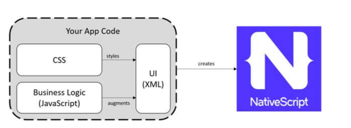
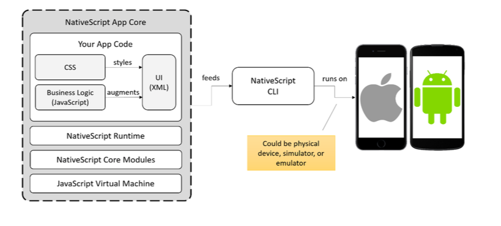

# LEZIONE 04/03/2019

## PARTE 1

### 1. Cos'è native script?

### 2. Perchè native script?

#### 2.1 Cosa significa digitale?
#### 2.2 Cosa significa linguaggio di programmazione astratto e come da un linguaggio astratto si arriva al codice binario
#### 2.3 Cosa significa compilare e che cos'è un compilatore
#### 2.4 Cosa è una macchina virtuale e cosa significa linguaggio interpretato
#### 2.5 Interpretato VS Compilato
#### 2.6 Interpretato VS Compilato nel mondo mobile (App ibrida, Native, JIT (Just in time compiled))

### 3. Come funziona native script

#### 3.1 Cosa puoi fare con Native Script?

#### 3.2 Cosa NON puoi fare con Native Script?

---

### PAUSA

## PARTE 2

### 4. Introduzione alla programmazione (Slide Algoritmi.pdf)

#### 4.1 Risolvere un problema

#### 4.2 Algoritmi, Programmi, Pseudocodice, Top-Down

#### 4.3 Variabili e Strutture di controllo e Diagrammi di Flusso

#### 4.4 Esempi di semplici algoritmi in pseudocodice

- Scrivere un algoritmo che, date le età di tre persone, calcoli l’età media.
- Scrivere un algoritmo che, dato il prezzo di un prodotto, applichi uno sconto del 12% se il prezzo è inferiore a € 30,00, del 25% altrimenti.
- Scrivere l'algoritmo che, letto in input un valore numerico, dica se è positivo, negativo o nullo
- Scrivere un algoritmo che, preso in input un valore compreso tra 1 e 12, visualizzi il nome del mese corrispondente
- Scrivere un algoritmo che visualizza i numeri naturali da 1 a 20
- Scrivere un algoritmo che visualizza in ordine decrescente i numeri naturali da 30 a 15

  

