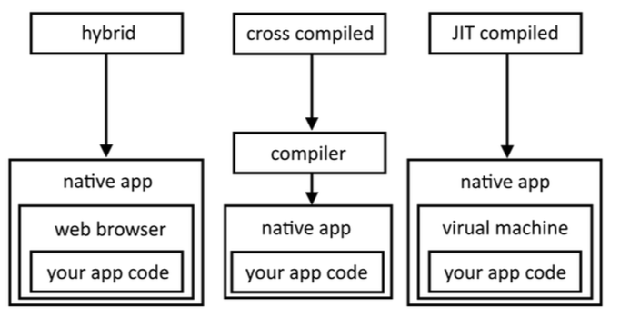

# SCALETTA LEZIONE 04/03/2018

## PARTE 1

### 1. Cos'è native script?

### 2. Perchè native script?
#### 2.1 Cosa significa digitale?
#### 2.2 Cosa significa linguaggio di programmazione astratto e come da un linguaggio astratto si arriva al codice binario
#### 2.3 Cosa significa compilare e che cos'è un compilatore
#### 2.4 Cosa è una macchina virtuale e cosa significa linguaggio interpretato
#### 2.5 Interpretato VS Compilato
#### 2.6 Interpretato VS Compilato nel mondo mobile (App ibrida, Native, JIT (Just in time compiled))

### 3. Come funziona native script

#### 3.1 Cosa puoi fare con Native Script?

#### 3.2 Cosa NON puoi fare con Native Script?

---

### PAUSA

## PARTE 2

### 4. Introduzione alla programmazione (Slide Algoritmi.pdf)

